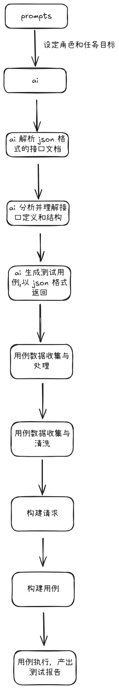

<div align="center">
    
    <h1 align="center">STAR ORBIT</h1>
</div>

<p align="center">
  <br>简体中文 | <a href="./readme/README_en.md">English</a>
</p>

一个用于接口自动化测试的 ai 智能体，当前处于 demo 探索阶段，练手项目，目前稳定性和智能性都很差，无实际作用。


## 工作流
<p align="center">
  
</p>


## 如何体验
### 本地运行

1. 确保本地具备 `Python3.13` 环境, 项目基于 `Python3.13` 未在其他版本测试，可能会有不兼容
2. 克隆此项目到本地
```commandline
git clone https://github.com/1p1e3/star-orbit.git
```
3. 使用 `Pycharm` 或其他 ide 打开，打开后配置虚拟环境
4. 安装项目依赖
```commandline
pip install -r requirements.txt 
```
5. 安装完成后, 先启动用于测试的 flask api 服务，在项目根目录下执行以下命令
```commandline
python flask_server.py
```
6. 在 Google AI Studio 创建 Gemini API Key(免费), 创建之后复制 key，并将 key 填入 core/agent.py 文件的下面这行代码中
```python
def gemini_client():
    # 创建客户端
    client = genai.Client(api_key="你的 key")
    ...
```
6. 开启新的终端，执行以下命令
```commandline
orbit
```
即可开启工作流并自动完成接口自动化测试,接口文档使用的是项目 api_docs 目录中自带的一份用于测试的接口文档

7. 如果你有一份 json 格式的接口文档(必须符合 openapi 规范，且接口各个字段有比较详细的说明),那么可以使用下面的命令开启工作流
```commandline
orbit json格式接口文档的绝对路径
```
例如:
```commandline
orbit C:\api.json
```
8. 工作流结束之后 html 测试报告会保存在 output 下面对应的子目录中


